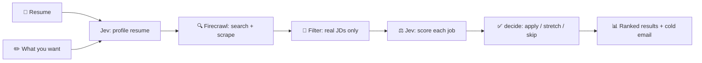

# AI Job Hunt Agent

An AI agent that finds real job postings for your resume and scores how well you fit each one.

## What it does

1. You give it a **resume** and say what you want (e.g. _"python intern Bengaluru"_)
2. It **searches the web** for matching job postings on real company career pages
3. It **scores each job** against your resume — skill overlap, experience level, bond risk
4. It gives you a **ranked list**: apply, stretch, or skip — with a one-click cold email draft

## Why Jev?

**Jev** is a structured decision model (served via the [TypeSafe SDK](https://typesafe.ai)). Instead of asking a chatbot _"is this job a good fit?"_ and parsing free text, Jev returns **typed answers** — a skill score (0–4), a bond probability (0.0–1.0), a verdict choice (apply/stretch/skip).

This matters because:

- **Deterministic** — same resume + same job = same score, every time
- **Cheap** — Jev calls cost ~$0.00005 each (billed on input tokens only)
- **Auditable** — every decision is a number you can inspect, not a paragraph to interpret

| Where Jev is used | What it returns | Why not a chat model? |
|---|---|---|
| **Resume profiling** | role family, level, language | Structured choices, not a paragraph |
| **Job scoring** | skill overlap (0–4), bond probability, experience bar, pay type, verdict | Numbers feed a deterministic gate — no prompt hacking |

The **chat model** (GPT-4o etc.) only drives the Strands agent loop and drafts the cold email. It never sees the full resume or scores jobs.

## Architecture



**Two agent tools, then it stops:**

- **`scan_jobs`** — searches the web, keeps only recruiter pages (Greenhouse, Lever, Ashby, company sites), deduplicates, and ranks by keyword match. Zero model tokens.
- **`score_jobs`** — scrapes each page, drops dead postings, asks Jev to score the survivors, then `decide()` maps scores to apply/stretch/skip.

## Project structure

```
app.py                    CLI entry point
gradio_app.py             Gradio web UI
placement/
  __init__.py             resume loader (PDF / md / txt)
  agent.py                Strands agent with two tools
  hunt.py                 search → scrape → score pipeline + ranking
  score.py                Jev scoring + decide() gate
  profile.py              Jev resume profiling + search query builder
  scrape.py               Firecrawl search and page scrape
  filters.py              URL / title / JD heuristics
  cache.py                local cache for pages and scores
  settings.py             env config
  spend.py                cost and token tracking
  write.py                cold email draft
resume.md                 sample resume (fictional)
```

## Setup

Requires Python 3.10+.

```powershell
python -m venv venv
venv\Scripts\Activate.ps1
pip install -r requirements.txt
copy .env.example .env
```

Fill in `.env`:

| Variable | What |
|---|---|
| `FUTUREX_API_KEY` | One key for both the chat model and Jev |
| `FUTUREX_BASE_URL` | OpenAI-compatible root, including `/v1` |
| `JEV_BASE_URL` | TypeSafe root, no `/v1` (the SDK appends it) |
| `JEV_MODEL` | Defaults to `jev-latest` |
| `CHAT_MODEL` | Chat model id served by the gateway |
| `FIRECRAWL_API_KEY` | From [firecrawl.dev](https://firecrawl.dev) |

## Usage

```powershell
# Hunt with the sample resume
python app.py --want "python intern Bengaluru"

# Hunt with your own CV
python app.py --resume path\to\resume.pdf --want "data analyst intern remote"

# Run the web UI
python gradio_app.py
```

### Example output

```
6 jobs
 #  match  role
 1   90%  Weekday - Software Engineer Intern
    weekdayworks  https://jobs.lever.co/weekdayworks/a86efff4-...
 2   45%  Backend Software Engineer - Python/Postgres [Remote / Global]
    enveritas  https://job-boards.greenhouse.io/enveritas/jobs/4006514008

This hunt
  time: 38.9s
  Jev calls: 7
  Jev input tokens: 11660
  Jev cost: $0.000490
  Cache hits: 0
```

### Caching

Run the same hunt twice — the second run serves from `.cache/` and finishes in seconds:

```
  time: 11.4s
  Jev calls: 1        (profile only)
  Jev cost: $0.000034
  Cache hits: 12
```

Scores are keyed by job URL + resume + want text. Edit any of them and it re-scores honestly. Delete `.cache/` to start fresh.

## How scoring works

One Jev call profiles the resume. One Jev call per surviving job scores it.

| Question | Type | What it decides |
|---|---|---|
| `skill_overlap` | Score 0–4 | Core gate: apply (3+), stretch (2+), or skip |
| `requires_bond` | Probability | Skip if > 65% — protects students from bond traps |
| `above_fresher` | Probability | Skip if > 65% — the role needs 1+ years experience |
| `pay_type` | Choice | Stipend / salaried / not posted — shown in results |
| `verdict` | Choice | Jev's own apply/stretch/skip — printed alongside the code decision |

`decide()` is deterministic and **overrides** Jev's verdict when they disagree. A bond or experience bar skips the job no matter how strong the skills are.

## Notes

- `resume.md` is a fictional sample student. Replace it before hunting for real.
- Firecrawl's free plan allows 10 scrapes per minute; the agent stops cleanly on a 429.
