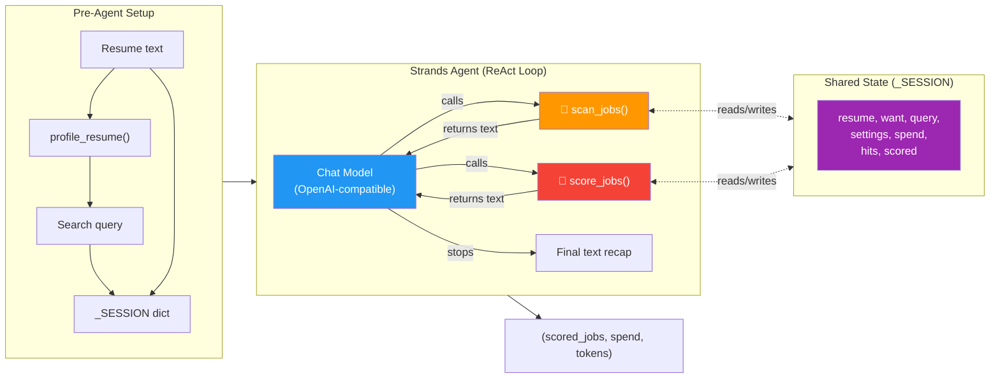
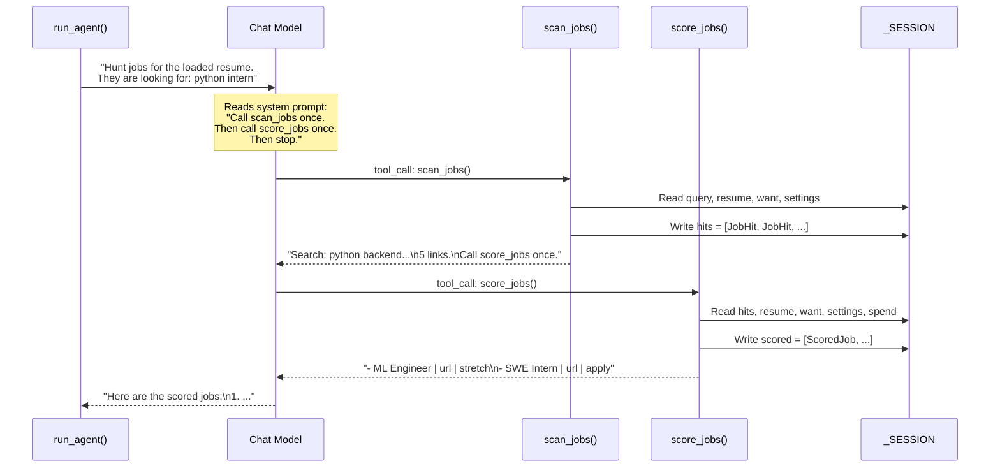

# Agent Architecture — Deep Dive

## The Big Picture

The agent in [agent.py](file:///d:/NavigateLabs/L&D/NIT%20CALICut/ai-job-hunt/placement/agent.py) uses the **Strands SDK** — a framework for building tool-calling AI agents. The architecture follows the **ReAct pattern** (Reason → Act → Observe → Repeat), but with heavy guardrails to make it behave like a **deterministic 2-step pipeline** rather than an open-ended chatbot.



---

## How `run_agent()` Works — Line by Line

**File:** [agent.py:79-122](file:///d:/NavigateLabs/L&D/NIT%20CALICut/ai-job-hunt/placement/agent.py#L79-L122)

### Phase 1: Pre-Agent Setup (lines 80-93)

```python
spend = Spend()                                    # ① Cost tracker starts
profile = profile_resume(resume, settings, looking_for)  # ② Jev classifies resume
spend.add_jev(profile.input_tokens)                # ③ Count the Jev tokens
```

Before the agent even starts, `profile_resume()` makes **one Jev call** to classify the resume into `role` / `level` / `language`, then builds a search query like:

```
"python backend engineer intern hiring careers greenhouse.io lever.co ashbyhq.com"
```

Then the **session state** is prepared:

```python
_SESSION.clear()
_SESSION.update(
    resume=resume,          # Full resume text
    want=looking_for,       # User's "what I want" string
    query=profile.query,    # Built search query
    settings=settings,      # API keys
    spend=spend,            # Cost tracker (mutated by tools)
    hits=None,              # ← Will be filled by scan_jobs
    scored=None,            # ← Will be filled by score_jobs
)
```

> [!IMPORTANT]
> `_SESSION` is a **module-level dict** (line 24). Both tools and `run_agent` share it. This is the glue between the LLM's tool calls and the actual Python code. The agent (LLM) never sees the resume or settings directly — it only calls tools that read from `_SESSION`.

### Phase 2: Agent Construction (lines 96-108)

```python
model = OpenAIModel(
    client_args={
        "api_key": settings.futurex_api_key,
        "base_url": settings.futurex_base_url,     # ← Custom LLM endpoint
    },
    model_id=settings.chat_model,
    params={"temperature": 0},                      # ← Deterministic
)
agent = Agent(
    model=model,
    tools=[scan_jobs, score_jobs],                   # ← Only 2 tools available
    system_prompt=SYSTEM,
    callback_handler=None,                           # ← No streaming callbacks
)
```

Four key design choices:

| Choice | Why |
|--------|-----|
| `temperature: 0` | No randomness — same input always produces the same tool sequence |
| Only 2 tools | The LLM can't do anything except call `scan_jobs` and `score_jobs` |
| `callback_handler=None` | No streaming — wait for the full response |
| Custom `base_url` | Uses FutureX (not OpenAI directly) as the LLM provider |

### Phase 3: Agent Execution (lines 110-116)

```python
prompt = "Hunt jobs for the loaded resume."
if want.strip():
    prompt += f" They are looking for: {want.strip()[:300]}"
result = agent(prompt)          # ← The ReAct loop runs here
```

`agent(prompt)` triggers the **Strands ReAct loop**:



### Phase 4: Post-Agent (lines 117-122)

```python
scored = _SESSION.get("scored") or []    # Read what score_jobs wrote
print_shortlist(scored)                   # Pretty-print the results
chat_in, chat_out = _chat_tokens(result.metrics)  # Extract token counts
print(spend.report(chat_in, chat_out))    # Print cost summary
return scored, spend, chat_in, chat_out   # Return to caller
```

---

## The Two Tools — Contract & Guards

### `scan_jobs()` — [line 28](file:///d:/NavigateLabs/L&D/NIT%20CALICut/ai-job-hunt/placement/agent.py#L28)

```python
@tool
def scan_jobs() -> str:
```

| Aspect | Detail |
|--------|--------|
| **Input** | None (reads from `_SESSION`) |
| **Output** | Text string the LLM reads as the tool result |
| **Side effect** | Sets `_SESSION["hits"]` = list of JobHit |
| **Guard** | If already called, returns "Already scanned. Call score_jobs." |
| **Calls** | `collect_hits()` → Firecrawl search + URL filter + rank |

### `score_jobs()` — [line 44](file:///d:/NavigateLabs/L&D/NIT%20CALICut/ai-job-hunt/placement/agent.py#L44)

```python
@tool
def score_jobs() -> str:
```

| Aspect | Detail |
|--------|--------|
| **Input** | None (reads from `_SESSION`) |
| **Output** | Text string with scored job summaries |
| **Side effect** | Sets `_SESSION["scored"]` = list of ScoredJob |
| **Guard** | If no hits yet → "Call scan_jobs first" |
| **Guard** | If already scored → "Already scored. Stop." |
| **Calls** | `scrape_top()` → Firecrawl scrape, then `evaluate()` → Jev scoring |

---

## How the Agent is Constrained

The system uses **4 layers of constraint** to prevent the LLM from going rogue:

```
Layer 1: System Prompt
  "Call scan_jobs once. Then call score_jobs once. Then stop.
   Do not search again. Do not invent jobs."

Layer 2: Tool Guards (idempotency)
  scan_jobs:  "Already scanned" if hits exist
  score_jobs: "Already scored" if scored exists
              "No links yet" if hits don't exist

Layer 3: Limited Tool Set
  Only 2 tools registered. The LLM literally cannot
  do anything else — no web browsing, no file writing.

Layer 4: Temperature 0
  No randomness. The LLM always picks the same
  tool sequence for the same input.
```

This makes the agent behave like a **deterministic pipeline** that just happens to be orchestrated by an LLM, rather than a free-form chatbot.

---

## Session State Lifecycle

```
┌─────────────────────────────────────────────────────────┐
│ _SESSION (module-level dict)                            │
│                                                         │
│  run_agent() sets:                                      │
│    resume ──────────── full resume text                  │
│    want ────────────── "python intern Bengaluru"         │
│    query ───────────── built search string               │
│    settings ────────── API keys                          │
│    spend ───────────── Spend() cost tracker              │
│    hits ────────────── None (initially)                  │
│    scored ──────────── None (initially)                  │
│                                                         │
│  scan_jobs() writes:                                    │
│    hits ────────────── [JobHit, JobHit, ...] ✅          │
│                                                         │
│  score_jobs() reads hits, writes:                       │
│    scored ──────────── [ScoredJob, ScoredJob, ...] ✅    │
│                                                         │
│  run_agent() reads scored after agent finishes          │
└─────────────────────────────────────────────────────────┘
```

> [!WARNING]
> Because `_SESSION` is module-level, **concurrent hunts would collide**. This is safe for single-user Gradio but would break under parallel requests. The `_SESSION.clear()` at the start of each `run_agent()` call resets state.

---

## What the LLM Actually Sees

The LLM never sees the resume, API keys, or raw job data. It only sees:

1. **System prompt** — the 6-line instruction
2. **User prompt** — "Hunt jobs for the loaded resume. They are looking for: python intern"
3. **Tool results** — text strings returned by `scan_jobs()` and `score_jobs()`
4. **Tool schemas** — auto-generated from the `@tool` decorated functions (name + docstring)

The LLM's only job is to decide: *"Which tool do I call next?"* — and the system prompt + guards make that decision trivial.
